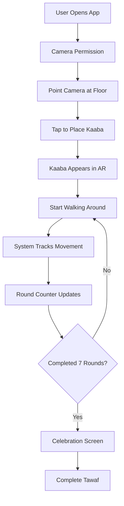

# Conceptual Model for Tawaf AR Trainer

## 🎯 **Core Conceptual Metaphors**

### **Primary Metaphor: "Virtual Kaaba in Real Space"**
- **Concept:** Users see a virtual Kaaba placed in their real physical environment
- **Mapping:** Real-world movement around virtual object = Tawaf ritual
- **Expectation:** Walking in circles around the virtual Kaaba simulates the actual Tawaf experience

### **Secondary Metaphor: "Progress Tracking"**
- **Concept:** Visual progress indicators show completion of rounds
- **Mapping:** Progress bar/round counter = physical completion of Tawaf
- **Expectation:** Users understand they need to complete 7 rounds

## 🏃‍♂️ **Spatial Interaction Model**

### **Spatial Reference Frame:**
- **Egocentric:** User's position relative to the virtual Kaaba
- **Allocentric:** Fixed Kaaba position in world space
- **Hybrid:** User moves around fixed Kaaba (like real Tawaf)

### **Movement Constraints:**
- **Distance Range:** 0.5-3 meters from Kaaba (optimal tracking)
- **Movement Pattern:** Circular motion around Kaaba
- **Spatial Awareness:** User must maintain awareness of their position relative to Kaaba

## 👆 **Interactive Elements Model**

### **Direct Manipulation:**
- **Touch to Place:** Tap screen to create Kaaba
- **Physical Movement:** Walk around Kaaba to complete rounds
- **Proximity Detection:** System detects when user is near corners or Hajar al-Aswad

### **Feedback Systems:**
- **Visual Feedback:** UI elements, progress indicators, corner markers
- **Audio Feedback:** Prayer recitations, completion sounds
- **Haptic Feedback:** (Potential) Vibration for corner detection

## 📊 **Information Architecture**

### **Information Layers:**
1. **Primary Layer:** Round counter and progress
2. **Secondary Layer:** Distance indicator and status
3. **Tertiary Layer:** Corner markers and Hajar al-Aswad detection
4. **Background Layer:** Instructions and guidance

### **Information Flow:**
- **Input:** User movement and position
- **Processing:** Round counting, distance calculation, corner detection
- **Output:** Visual UI updates, audio feedback, completion celebration

## 🧠 **User Mental Model**

### **User Expectations:**
- "I need to walk around the Kaaba 7 times"
- "The app will track my movement and count my rounds"
- "I should stay within a certain distance for best tracking"
- "The app will guide me through the ritual"

### **Learning Model:**
- **Discovery:** Users learn through exploration and feedback
- **Progressive Disclosure:** Information revealed as needed
- **Error Prevention:** Clear visual indicators prevent mistakes

## 🌍 **Spatial Computing Concepts**

### **Embodied Interaction:**
- **Body as Controller:** User's physical movement controls the experience
- **Spatial Memory:** Users remember where they are in relation to Kaaba
- **Proprioception:** Awareness of body position and movement

### **Augmented Reality Concepts:**
- **Spatial Anchoring:** Virtual Kaaba anchored to real space
- **Occlusion:** Real objects can occlude virtual Kaaba
- **Scale:** Virtual Kaaba scaled appropriately for real-world interaction

## 🎨 **Interaction Design Patterns**

### **Patterns Used:**
- **Direct Manipulation:** Touch to place Kaaba
- **Spatial Navigation:** Walking around virtual object
- **Progress Indication:** Visual progress bars and counters
- **Contextual Information:** Corner markers appear when relevant
- **Completion Celebration:** Special feedback when Tawaf is completed

## 📐 **Conceptual Model Diagram**

```
User Mental Model:
┌─────────────────────────────────────────────────────────┐
│                    Tawaf AR Trainer                     │
├─────────────────────────────────────────────────────────┤
│  Physical World    │    Virtual Layer    │    Feedback  │
│                    │                     │              │
│  User Movement     │    Virtual Kaaba    │    UI Display│
│  ──────────────    │    ─────────────    │    ───────── │
│  • Walk around     │    • Fixed position │    • Round # │
│  • Maintain dist   │    • Virtual object │    • Progress│
│  • Complete 7x     │    • Corner markers │    • Distance│
│                    │    • Hajar Aswad    │    • Status  │
└─────────────────────────────────────────────────────────┘
```

## 🎯 **Design Implications**

### **For Spatial Computing:**
- **Spatial Awareness:** Design must support user's spatial understanding
- **Movement Tracking:** Accurate tracking of user's circular motion
- **Environmental Adaptation:** Works in various real-world spaces

### **For Interactive Computing:**
- **Intuitive Controls:** Minimal learning curve for interaction
- **Clear Feedback:** Immediate response to user actions
- **Error Recovery:** Graceful handling of tracking errors

## 🔄 **Interaction Flow**



## 📱 **User Interface Conceptual Model**

### **UI Hierarchy:**
```
Main Interface
├── Title Bar (🕌 Tawaf AR Trainer)
├── Progress Section
│   ├── Round Counter (Round X/7)
│   ├── Progress Bar
│   └── Percentage
├── Status Section
│   ├── Distance Indicator
│   ├── Corner Markers (when near)
│   └── Hajar al-Aswad (when near)
└── Instructions
    ├── Movement Guide
    ├── Distance Guide
    └── Completion Goal
```

## 🎓 **Academic Context**

### **Spatial and Interactive Computing Concepts:**
- **Embodied Interaction:** Physical movement as input mechanism
- **Spatial Cognition:** How users understand and navigate virtual space
- **Augmented Reality:** Overlaying virtual content on real world
- **Human-Computer Interaction:** Design principles for AR interfaces

### **Key Research Areas:**
- **Spatial Memory:** How users remember virtual object locations
- **Proprioception in AR:** Body awareness in mixed reality
- **Circular Navigation:** User behavior in circular movement patterns
- **Religious Technology:** AR applications for spiritual practices

## 📋 **Implementation Considerations**

### **Technical Requirements:**
- **AR Foundation:** Unity's AR framework for cross-platform AR
- **Spatial Tracking:** Accurate position and orientation tracking
- **Gesture Recognition:** Touch and movement detection
- **Audio Integration:** Prayer recitation and feedback sounds

### **User Experience Requirements:**
- **Accessibility:** Support for users with different abilities
- **Cultural Sensitivity:** Respectful representation of religious practice
- **Error Handling:** Graceful degradation when tracking fails
- **Performance:** Smooth 60fps experience on mobile devices

---

*This Conceptual Model provides the foundation for understanding how users will interact with the Tawaf AR Trainer and guides design decisions for spatial and interactive computing applications.* 